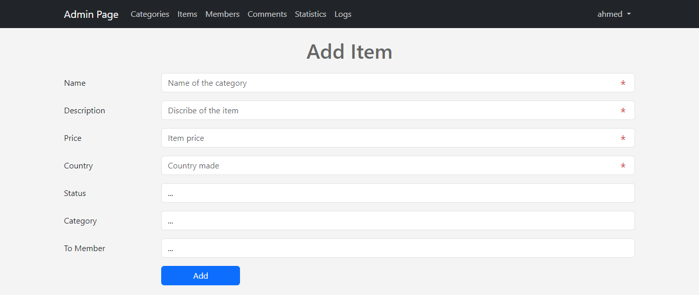

# Dashboard-for-eCommerce-Website

A new Web project.

## Features:

- Login and registeration screen.
- Recent users and products.
- Page contains all products.
- Page contains all users and users comments.
- Page contains all categories.
- Admin can manage all sections in website such as users, products, comments, and categories using CRUD operation.

## Used Technologies

- HTML
- CSS
- JavaScript
- jQuery
- Bootstrap
- PHP
- MySQL Database

#### Screenshots

